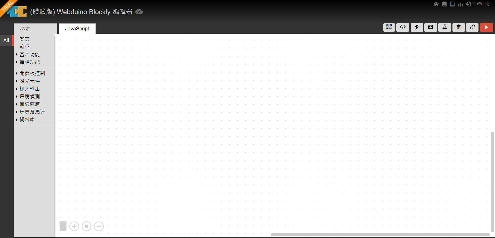
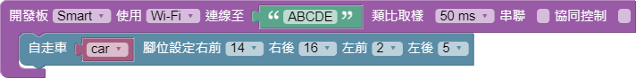

# 自走車程式

### 方法一👉掃描 QRcode \(每一台車子都有專屬的 QRcode喔\)

### 方法二👉跟著下面步驟一起學程式

#### 1. 登入程式平台 [https://blockly.webduino.io/](https://blockly.webduino.io/) \( 有 google 帳號的使用者可使用此連結 [https://id.webduino.io/signin](https://id.webduino.io/signin)\)

#### 2.開發版設定\(紫色方塊\)


開發版控制  ➡ 開發版


這邊要注意的是我們開發版是使用 Smart 喔!!

綠色方塊是 Device ID 要自己填入，EX : 我的板子 ID 是 ABCDE 所以就填入 ABCDE

如果忘記的可以到連線設定那一頁回憶

#### 3.腳位設定


玩具及馬達➡自走車


因為我們事先幫大家都將線路焊接完成，所以腳位要和我們設定一樣

#### 4.遙控器設定


遙控器在**燒瓶**裡面，點選燒瓶後會跳出**網頁互動測試**方塊，在頁面左下角也會跳出相對應的積木



自走車的動作在**玩具及馬達**➡中自走


